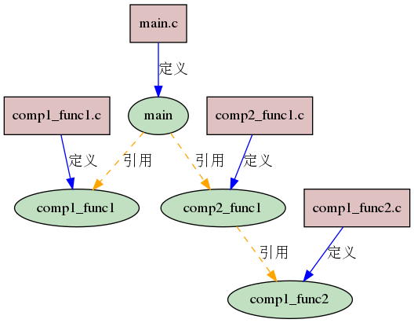
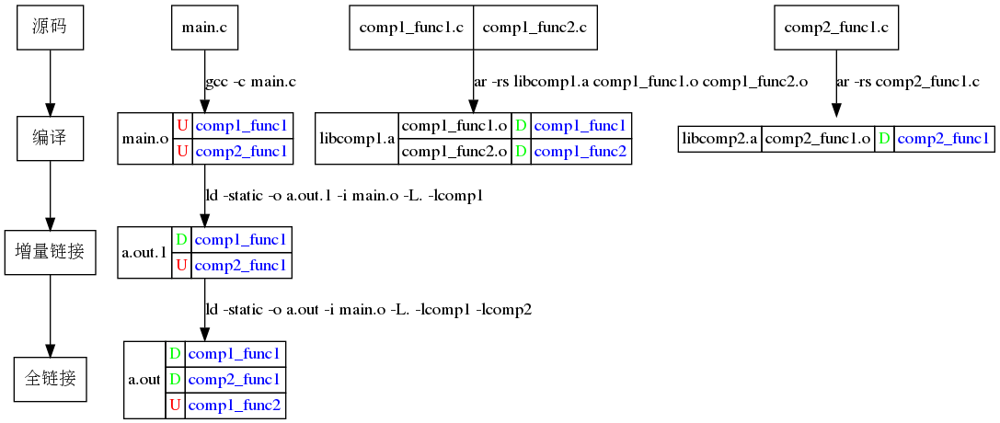

# 问题描述
项目中准备引入redis，采用acl的c++库对redis进行访问。acl的示例代码如下所示
```c++
#include <unistd.h>
#include "acl_cpp/lib_acl.hpp"

static acl::string __keypre("test_key");

static bool test_set(acl::redis& cmd, int n)
{
	acl::string key, val;
	for (int i = 0; i < n; i++)
	{
		key.format("%s_%d", __keypre.c_str(), i);
		val.format("val_%s", key.c_str());
		cmd.clear();
		if (cmd.set(key, val) == false)
		{
			printf("set key: %s error: %s\r\n", key.c_str(),
				cmd.result_error());
			return false;
		}
		else if (i < 10)
			printf("set key: %s ok\r\n", key.c_str());
	}
	return true;
}

int main(int argc, char* argv[])
{
	int  conn_timeout = 10, rw_timeout = 10, dbnum = 0;
	acl::string addr("127.0.0.1:6379");

	acl::acl_cpp_init();
	acl::log::stdout_open(true);

	acl::redis_client client(addr.c_str(), conn_timeout, rw_timeout);
    client.set_db(dbnum);
	acl::redis cmd(&client);

	bool ret = test_set(cmd, 10);
	if (ret == true)
		printf("test OK!\r\n");
	else
		printf("test failed!\r\n");
}
```

对示例代码进行编译链接
```bash
$ g++ redis_test.cpp -I`echo $HOME`/tool/acl-3.5.1-8/lib_acl_cpp/include -L`echo $HOME`/tool/acl-3.5.1-8/lib_acl/lib -L`echo $HOME`/tool/acl-3.5.1-8/lib_acl_cpp/lib -lacl -lacl_cpp -lpthread
```

报了许多链接的错误
```bash
tool/acl-3.5.1-8/lib_acl_cpp/src/stream/aio_listen_stream.cpp:198：对‘acl_aio_vstream’未定义的引用
tool/acl-3.5.1-8/lib_acl_cpp/src/stream/aio_listen_stream.cpp:203：对‘acl_vstream_accept’未定义的引用
tool/acl-3.5.1-8/lib_acl_cpp/src/stream/aio_listen_stream.cpp:208：对‘acl_aio_open’未定义的引用
tool/acl-3.5.1-8/lib_acl_cpp/lib/libacl_cpp.a(aio_listen_stream.o)：在函数‘acl::aio_listen_stream::hook_listen()’中：
acl-3.5.1-8/lib_acl_cpp/src/stream/aio_listen_stream.cpp:148：对‘acl_aio_listen’未定义的引用
```

# 问题分析
acl和acl_cpp均为静态库，acl是最基础的库，以C语言实现，其它库均依赖于该库; acl_cpp库用C++封装了acl库，提供给C++程序调用。

链接错误集中表现为acl_cpp库引用了acl库中的函数但未能找到其定义。

# 问题解决
在编译命令的参数中已给出了acl库的路径和名称，不应该找不到。尝试把acl_cpp库在命令行中的顺序放在acl库之前
```bash
$ g++ redis_test.cpp -I`echo $HOME`/tool/acl-3.5.1-8/lib_acl_cpp/include -L`echo $HOME`/tool/acl-3.5.1-8/lib_acl/lib -L`echo $HOME`/tool/acl-3.5.1-8/lib_acl_cpp/lib -lacl_cpp -lacl -lpthread
```
顺利编译通过。

# 原理探究
创建一个示例工程，包含main.c、comp1_func1.c、comp1_func2.c、comp2_func1.c四个文件，其函数调用关系如下所示：


1. 编译main.c
```bash
$ gcc -c main.c
$ objdump -t main.o
0000000000000000         *UND*	0000000000000000 comp1_func1
0000000000000000         *UND*	0000000000000000 comp2_func1
```
main.o中有两个未定义的符号：comp1_func1和comp2_func1

2. 编译静态库
```bash
选项r表示将后面的文件列表添加到文件包，如果文件包不存在就创建它；s专用于生成静态库，表示为静态库创建索引，这个索引被链接器使用；t显示静态库中的文件列表
$ ar -rs libcomp1.a comp1_func1.o comp1_func2.o
$ objdump -t libcomp1.a 
在归档文件 libcomp1.a 中：
comp1_func1.o：     文件格式 elf64-x86-64
SYMBOL TABLE:
0000000000000000 g     F .text	000000000000000e comp1_func1

comp1_func2.o：     文件格式 elf64-x86-64
0000000000000000 g     F .text	000000000000000e comp1_func2

$ ar -rs libcomp2.a comp2_func1.o
$ $ objdump -t libcomp2.a 
在归档文件 libcomp2.a 中：
comp2_func1.o：     文件格式 elf64-x86-64
SYMBOL TABLE:
0000000000000000 g     F .text	000000000000000c comp2_func1
0000000000000000         *UND*	0000000000000000 comp1_func2
```
libcomp2.a中有一个未定义的符号comp1_func2

3. 增量链接
将main.o和libcomp1.a先进行链接
```bash
$ ld -static -o a.out.1 -i main.o -L. -lcomp1
$ objdump -t a.out.1
0000000000000000 l    df *ABS*	0000000000000000 comp1_func1.c
0000000000000015 g     F .text	000000000000000e comp1_func1
0000000000000000         *UND*	0000000000000000 comp2_func1
```
链接器并不是把静态库文件看做一个整体，而是将打包在其中的目标文件(.o)作为链接单元。在链接过程中，如果某个目标文件中的符号被用到了，那么这个目标文件会单独从库文件中提取出来并入可执行程序，而其余的目标文件则会被丢弃。

main.o中引用了libcomp1.a中comp1_func1.o的comp1_func1函数，因此将comp1_func1.o并入，而comp1_func2.o中的comp1_func2函数未被引用，因此被丢弃。

4. 全量链接
将main.o和libcomp1.a、libcomp2.a进行链接
```bash
$ ld -static -o a.out -i main.o -L. -lcomp1 -lcomp2
$ objdump -t a.out
0000000000000000         *UND*	0000000000000000 comp1_func2
0000000000000015 g     F .text	000000000000000e comp1_func1
0000000000000023 g     F .text	000000000000000c comp2_func1
```
libcomp2.a中引用的comp1_func2函数虽然已在libcomp1.a中定义，但由于comp1_func2.o被丢弃，导致该函数找不到定义

```bash
$ ld -static -o a.out -i main.o -L. -lcomp2 -lcomp1
$ objdump -t a.out
000000000000002f g     F .text	000000000000000e comp1_func2
0000000000000021 g     F .text	000000000000000e comp1_func1
0000000000000015 g     F .text	000000000000000c comp2_func1
```
整个分析的过程可参考下图：


将静态库的顺序调换后，所有符号都找到了定义。所以在链接静态库的时候，应该将被依赖的库放在最右边。
